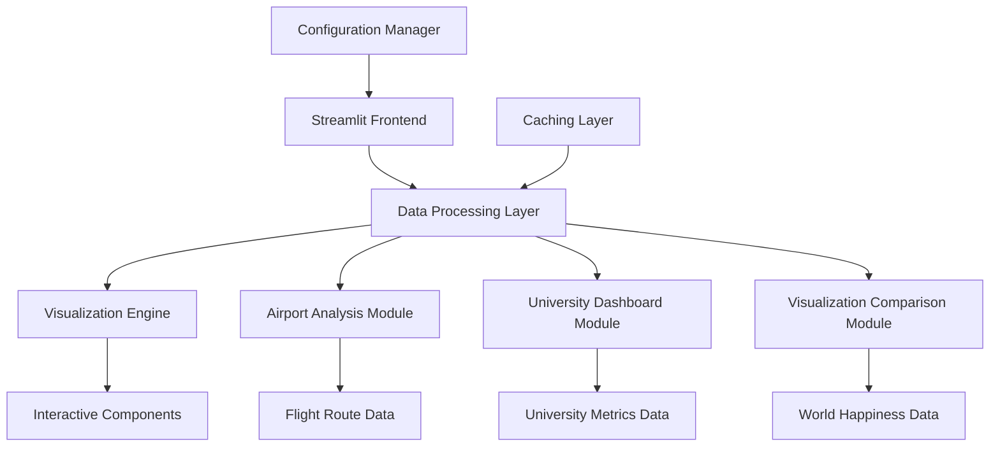

# 🔧 API Documentation - Flight Route Analytics Dashboard

## Table of Contents
1. [Architecture Overview](#architecture-overview)
2. [Core Components](#core-components)
3. [Data Processing Pipeline](#data-processing-pipeline)
4. [Visualization Components](#visualization-components)
5. [Configuration & Settings](#configuration--settings)
6. [Performance Optimization](#performance-optimization)

## Architecture Overview

### System Architecture



### Technology Stack

| Component | Technology | Purpose |
|-----------|------------|---------|
| **Frontend Framework** | Streamlit 1.28+ | Web application interface |
| **Data Processing** | Pandas 2.0+ | Data manipulation and analysis |
| **Visualization** | Plotly 5.0+ | Interactive charts and graphs |
| **Mapping** | Folium 0.14+ | Geographic visualization |
| **Statistical Analysis** | Scikit-learn 1.3+ | Machine learning and regression |
| **Numerical Computing** | NumPy 1.24+ | Mathematical operations |
| **Styling** | Custom CSS | UI/UX enhancement |

## Core Components

### Main Application Module

#### `src/app.py`
```python
"""
Main Streamlit application entry point
Handles navigation, page routing, and global configurations
"""

# Core Functions
def main():
    """Main application entry point"""
    
def setup_page_config():
    """Configure Streamlit page settings"""
    
def load_custom_css():
    """Apply custom styling"""
    
def handle_navigation():
    """Manage page routing and sidebar navigation"""
```

### Dashboard Components

#### Airport Analysis Module
```python
"""
Flight route analysis and visualization
Location: src/components/airport_analysis.py (to be created)
"""

class AirportAnalyzer:
    def __init__(self, airport_code: str):
        self.airport_code = airport_code
        self.data = self.load_airport_data()
    
    def load_airport_data(self) -> pd.DataFrame:
        """Load and process airport route data"""
        
    def create_route_map(self) -> folium.Map:
        """Generate interactive route map"""
        
    def analyze_destinations(self) -> dict:
        """Analyze top destinations and patterns"""
        
    def generate_flight_distribution(self) -> dict:
        """Calculate flight distribution metrics"""
```

#### University Dashboard Module
```python
"""
University performance monitoring and analytics
Location: src/components/university_dashboard.py (to be created)
"""

class UniversityDashboard:
    def __init__(self):
        self.data = self.load_university_data()
    
    def load_university_data(self) -> pd.DataFrame:
        """Load university performance data"""
        
    def calculate_kpis(self, filtered_data: pd.DataFrame) -> dict:
        """Calculate key performance indicators"""
        
    def generate_trends(self, data: pd.DataFrame) -> dict:
        """Analyze enrollment and retention trends"""
        
    def departmental_analysis(self, data: pd.DataFrame) -> dict:
        """Perform department-level analysis"""
```

#### Visualization Comparison Module
```python
"""
Data visualization best practices demonstration
Location: src/components/visualization_comparison.py (to be created)
"""

class VisualizationComparison:
    def __init__(self):
        self.happiness_data = self.load_happiness_data()
    
    def load_happiness_data(self) -> pd.DataFrame:
        """Load World Happiness Report data"""
        
    def create_poor_visualization(self) -> matplotlib.figure.Figure:
        """Generate example of poor visualization practices"""
        
    def create_improved_visualization(self) -> matplotlib.figure.Figure:
        """Generate example of improved visualization"""
        
    def statistical_analysis(self) -> dict:
        """Perform correlation and regression analysis"""
```

## Data Processing Pipeline

### Data Loading and Caching

#### Caching Strategy
```python
@st.cache_data
def load_airport_data(airport_code: str) -> pd.DataFrame:
    """
    Load airport data with caching for performance optimization
    
    Args:
        airport_code (str): IATA airport code (JFK, ATL, MIA, BOS, PHL)
    
    Returns:
        pd.DataFrame: Processed flight route data
    
    Cache Parameters:
        - TTL: 3600 seconds (1 hour)
        - Max entries: 10
        - Show spinner: True
    """
    
@st.cache_data
def load_university_data() -> pd.DataFrame:
    """
    Load university performance data with caching
    
    Returns:
        pd.DataFrame: University metrics data
    """
    
@st.cache_data
def load_happiness_data() -> pd.DataFrame:
    """
    Load World Happiness Report data with caching
    
    Returns:
        pd.DataFrame: Happiness and economic indicators
    """
```

### Data Validation and Cleaning

#### Validation Pipeline
```python
def validate_airport_data(df: pd.DataFrame) -> pd.DataFrame:
    """
    Validate and clean airport route data
    
    Validation Steps:
    1. Check required columns exist
    2. Validate coordinate ranges
    3. Remove duplicate routes
    4. Handle missing values
    5. Standardize airport codes
    """
    
def validate_university_data(df: pd.DataFrame) -> pd.DataFrame:
    """
    Validate and clean university performance data
    
    Validation Steps:
    1. Ensure numeric columns are properly typed
    2. Validate date ranges
    3. Check for logical inconsistencies
    4. Handle missing enrollment data
    """
```

### Data Transformation

#### Feature Engineering
```python
def engineer_airport_features(df: pd.DataFrame) -> pd.DataFrame:
    """
    Create derived features for airport analysis
    
    New Features:
    - Distance calculations
    - Route popularity rankings
    - Time-based categorizations
    - Regional classifications
    """
    
def calculate_university_metrics(df: pd.DataFrame) -> pd.DataFrame:
    """
    Calculate university performance metrics
    
    Calculated Metrics:
    - Acceptance rates
    - Yield rates
    - Retention improvements
    - Department growth rates
    """
```

## Visualization Components

### Interactive Charts

#### Plotly Configuration
```python
# Standard Plotly configuration for all charts
PLOTLY_CONFIG = {
    'displayModeBar': True,
    'displaylogo': False,
    'modeBarButtonsToRemove': [
        'pan2d', 'lasso2d', 'autoScale2d', 'hoverClosestCartesian',
        'hoverCompareCartesian', 'toggleSpikelines'
    ],
    'toImageButtonOptions': {
        'format': 'png',
        'filename': 'dashboard_chart',
        'height': 600,
        'width': 1000,
        'scale': 2
    }
}

# Color schemes for consistent branding
COLOR_SCHEMES = {
    'primary': ['#1f77b4', '#ff7f0e', '#2ca02c', '#d62728', '#9467bd'],
    'regional': {
        'Europe': '#1f77b4',
        'North America': '#ff7f0e',
        'Latin America': '#2ca02c',
        'Asia & Pacific': '#d62728',
        'Middle East': '#9467bd',
        'Africa': '#8c564b'
    },
    'sequential': 'Blues'
}
```

#### Chart Generation Functions
```python
def create_route_map(airport_data: pd.DataFrame, source_coords: tuple) -> folium.Map:
    """
    Create interactive flight route map
    
    Args:
        airport_data: Flight route data
        source_coords: (latitude, longitude) of source airport
    
    Returns:
        folium.Map: Interactive map with flight routes
    """
    
def create_trend_chart(data: pd.DataFrame, metrics: list) -> go.Figure:
    """
    Create multi-line trend chart
    
    Args:
        data: Time series data
        metrics: List of columns to plot
    
    Returns:
        go.Figure: Plotly line chart
    """
    
def create_comparison_chart(data: pd.DataFrame, category: str) -> go.Figure:
    """
    Create grouped bar chart for comparisons
    
    Args:
        data: Comparison data
        category: Grouping category
    
    Returns:
        go.Figure: Plotly bar chart
    """
```

### Map Visualizations

#### Folium Map Configuration
```python
# Default map settings
MAP_CONFIG = {
    'zoom_start': 3,
    'tiles': 'OpenStreetMap',
    'prefer_canvas': True,
    'control_scale': True
}

# Marker styles
MARKER_STYLES = {
    'source_airport': {
        'color': 'red',
        'icon': 'plane',
        'prefix': 'fa'
    },
    'domestic_destination': {
        'color': 'blue',
        'icon': 'plane',
        'prefix': 'fa'
    },
    'international_destination': {
        'color': 'green',
        'icon': 'plane',
        'prefix': 'fa'
    }
}
```

## Configuration & Settings

### Application Configuration

#### Streamlit Page Config
```python
PAGE_CONFIG = {
    'page_title': 'Visual Analytics and Communication Test 1',
    'page_icon': '📊',
    'layout': 'wide',
    'initial_sidebar_state': 'expanded',
    'menu_items': {
        'Get Help': 'https://github.com/Apc0015/Flight-Route-Dashboard',
        'Report a bug': 'https://github.com/Apc0015/Flight-Route-Dashboard/issues',
        'About': 'Interactive Flight Route & Analytics Dashboard'
    }
}
```

#### Custom CSS Styling
```css
/* Main styling variables */
:root {
    --primary-color: #1E88E5;
    --secondary-color: #0D47A1;
    --accent-color: #D81B60;
    --background-color: #e3f2fd;
    --text-color: #1a1a1a;
    --font-family: 'Segoe UI', Tahoma, Geneva, Verdana, sans-serif;
}

/* Component-specific styles */
.main-header {
    font-size: 2.5rem;
    font-weight: bold;
    margin-bottom: 1rem;
    color: var(--primary-color);
}

.sub-header {
    font-size: 1.8rem;
    font-weight: bold;
    margin-top: 1.5rem;
    margin-bottom: 1rem;
    color: var(--secondary-color);
}

.insight-box {
    background-color: var(--background-color);
    padding: 1rem;
    border-radius: 0.5rem;
    margin: 1rem 0;
    border-left: 5px solid var(--primary-color);
}
```

### Data Configuration

#### Airport Coordinates
```python
AIRPORT_COORDINATES = {
    'JFK': {'lat': 40.6413, 'lon': -73.7781, 'name': 'John F. Kennedy International'},
    'ATL': {'lat': 33.6407, 'lon': -84.4277, 'name': 'Hartsfield-Jackson Atlanta International'},
    'MIA': {'lat': 25.7932, 'lon': -80.2906, 'name': 'Miami International'},
    'BOS': {'lat': 42.3656, 'lon': -71.0096, 'name': 'Boston Logan International'},
    'PHL': {'lat': 39.8729, 'lon': -75.2437, 'name': 'Philadelphia International'}
}
```

#### Data File Paths
```python
DATA_PATHS = {
    'happiness_data': 'data/raw/2022.csv',
    'university_data': 'data/raw/university_data.csv',
    'processed_data_dir': 'data/processed/',
    'assets_dir': 'assets/',
    'screenshots_dir': 'assets/screenshots/'
}
```

## Performance Optimization

### Caching Strategy

#### Memory Management
```python
# Cache configuration for different data types
CACHE_CONFIG = {
    'airport_data': {
        'ttl': 3600,  # 1 hour
        'max_entries': 10,
        'allow_output_mutation': False
    },
    'university_data': {
        'ttl': 7200,  # 2 hours
        'max_entries': 5,
        'allow_output_mutation': False
    },
    'visualization_data': {
        'ttl': 1800,  # 30 minutes
        'max_entries': 20,
        'allow_output_mutation': True
    }
}
```

#### Performance Monitoring
```python
def monitor_performance():
    """
    Monitor application performance metrics
    
    Tracked Metrics:
    - Page load times
    - Data processing duration
    - Memory usage
    - Chart rendering speed
    """
    
def optimize_data_loading():
    """
    Optimize data loading performance
    
    Strategies:
    - Lazy loading for large datasets
    - Parallel processing for independent operations
    - Efficient data structures
    - Memory-conscious operations
    """
```

### Error Handling

#### Exception Management
```python
class DashboardError(Exception):
    """Base exception for dashboard operations"""
    pass

class DataLoadError(DashboardError):
    """Raised when data loading fails"""
    pass

class VisualizationError(DashboardError):
    """Raised when visualization creation fails"""
    pass

def handle_data_errors(func):
    """Decorator for handling data-related errors"""
    def wrapper(*args, **kwargs):
        try:
            return func(*args, **kwargs)
        except (FileNotFoundError, pd.errors.EmptyDataError) as e:
            st.error(f"Data loading error: {str(e)}")
            return None
        except Exception as e:
            st.error(f"Unexpected error: {str(e)}")
            return None
    return wrapper
```

---

*This API documentation is maintained alongside the codebase. For implementation details, refer to the source code in the `src/` directory.*